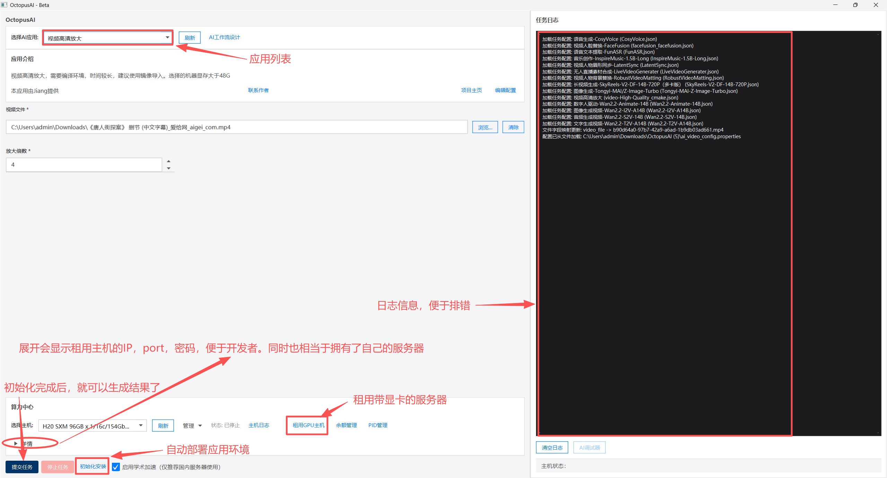

# 🚀 Project AI-Engine: Private, Uncensored & Developer-First AI Ecosystem
# 🚀 Project AI-Engine: 全功能私有化、无限制创作与开发者生态

  
  
  
  

---

## 🌟 Overview / 概述

**EN:** Project AI-Engine is a next-generation AI production platform. Unlike centralized AI tools, we provide **Automated Private Deployment**. By renting a dedicated server, you get a clean, high-performance environment with zero censorship and full SSH control.

**CN:** Project AI-Engine 是下一代 AI 生产力平台。与传统的中心化 AI 工具不同，我们提供**全自动化私有化部署方案**。通过租用独占服务器，你将获得一个纯净、高性能且完全不受限的运行环境，并拥有完整的 SSH 控制权。

---

## 📺 Showcase / 视觉演示

### 🎬 AI Video & Upscaling / AI 视频生成与超清修复
- GitHub README 不能直接内嵌播放视频，采用“封面图 + 点击播放”方式，风格参考示例项目。
- 在线播放页（GitHub Pages）：<https://jiang926.github.io/OctopusAI/>（如未开启，请在 Settings -> Pages 选择 docs/ 目录启用）。

  
  

    示例 1：Text-to-Image（点击封面或 <a href="https://raw.githubusercontent.com/jiang926/OctopusAI/master/source/a.mp4">播放/下载</a>）
  

 

  
  

    示例 2：Style Transfer（点击封面或 <a href="https://raw.githubusercontent.com/jiang926/OctopusAI/master/result/a_result.mp4">播放/下载</a>）
  

### 🎨 Uncensored Creativity / 无限制艺术创作
- 真正的 Prompt 自由；多模型/Lora 支持；4K/8K 无损画质。

---

## 🔥 Why Private Deployment? / 为什么选择私有化？

| Feature / 特性 | Centralized API (MJ/DALL-E) | **Project AI-Engine** |
| :--- | :--- | :--- |
| **Content Censorship / 内容审查** | Strict Filtering (关键词过滤) | **None / 完全自由 (Uncensored)** |
| **Data Privacy / 数据隐私** | Uploaded to Cloud (数据上云) | **100% Private (物理隔离)** |
| **Environment / 环境控制** | Closed Box (黑盒) | **Full SSH Access (最高控制权)** |
| **Model Customization / 模型自定义** | Limited (受限) | **Unlimited (支持自定义 Lora/Checkpoints)** |

---

## 🛠 Features / 功能矩阵

- [x] **Text-to-Image / 文生图:** Full Stable Diffusion ecosystem support. Load any model (Flux, SDXL, Pony).
- [x] **Text-to-Video / 文生视频:** High-fidelity dynamic video generation.
- [x] **Video Production / 视频制作:** Professional toolchain for video synthesis.
- [x] **Video Upscaling / 视频高清放大:** Industry-leading algorithms (SR) to restore 4K/8K details.
- [x] **Auto-Deployment / 自动化部署:** One-click environment setup (CUDA, Drivers, AI Frameworks).

---

## 👩‍💻 For Developers / 开发者专区

### 🔑 SSH & Full Control / SSH 访问
**EN:** Upon deployment, you receive a dedicated IP and SSH credentials. Use your favorite IDE (VS Code, PyCharm) to connect remotely and modify any underlying logic.
**CN:** 部署完成后，平台直接交付服务器 IP 与 SSH 凭证。支持 VS Code 等远程连接，自由修改底层逻辑或安装特定依赖。

### 💰 Monetize Your Ideas / 创意变现
**EN:** Have a unique AI workflow or a self-trained model?
1. **Submit:** Contact us to list your feature on our platform.
2. **Earn:** Get a commission for every user who utilizes your tool. Turn your code into a passive income stream.

**CN:** 拥有独特的工作流或自建模型？
1. **上架：** 联系官方，将你的功能集成到平台功能库。
2. **收益：** 只要有用户使用你的功能，即可获得佣金分成。让你的代码为你创造持续收益。

---

## 🚀 Quick Start / 快速上手

1. **Visit:** [Your Platform URL]
2. **Select Node:** Choose your GPU (RTX 4090, A100, etc.).
3. **Deploy:** One-click to initialize the AI environment (3-5 mins).
4. **Create:** Access via WebUI or SSH into the backend.

## 🧭 应用功能演示 / 使用步骤

步骤说明（对应截图标注）：
1) 在「选择AI应用」下拉选择需要的工作流，点击「刷新」同步列表。  
2) 填写/检查「应用介绍」与输入参数（如素材路径、放大倍率等）。  
3) 点击底部「租用GPU主机」获取带显卡的服务器，自动显示主机 IP、端口和密码，方便远程开发与调试。  
4) 勾选「自动部署应用环境」，点击「提交任务」一键初始化依赖并运行。  
5) 右侧「任务日志」实时展示加载/推理进度，便于排错。  
6) 初始化完成后可直接生成结果；需要时可在底部入口查看部署日志、AI调试面板或重置任务。  

## 📂 项目结构

- `img/`：存放说明或演示图片。  
- `source/`：存放源素材文件（如输入视频/图片）。  
- `result/`：存放运行或推理生成的结果文件。  
- `task_configs/`：应用功能配置文件，开发者可参考并自定义扩展。  

## 📦 App 下载

- Windows/macOS 客户端压缩包：<https://octopusai.oss-cn-shenzhen.aliyuncs.com/downloads/OctopusAI.zip>

---

## 🤝 Contact & Join Us / 联系与加入

**Email:** `xxx@example.com`  
**Discord/WeChat:** `[Your ID]`

**"Break the limits. Own your AI." / "打破束缚，掌握属于你的 AI。"**

---